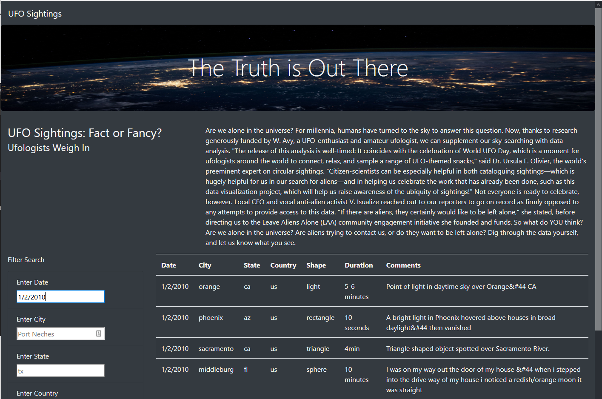
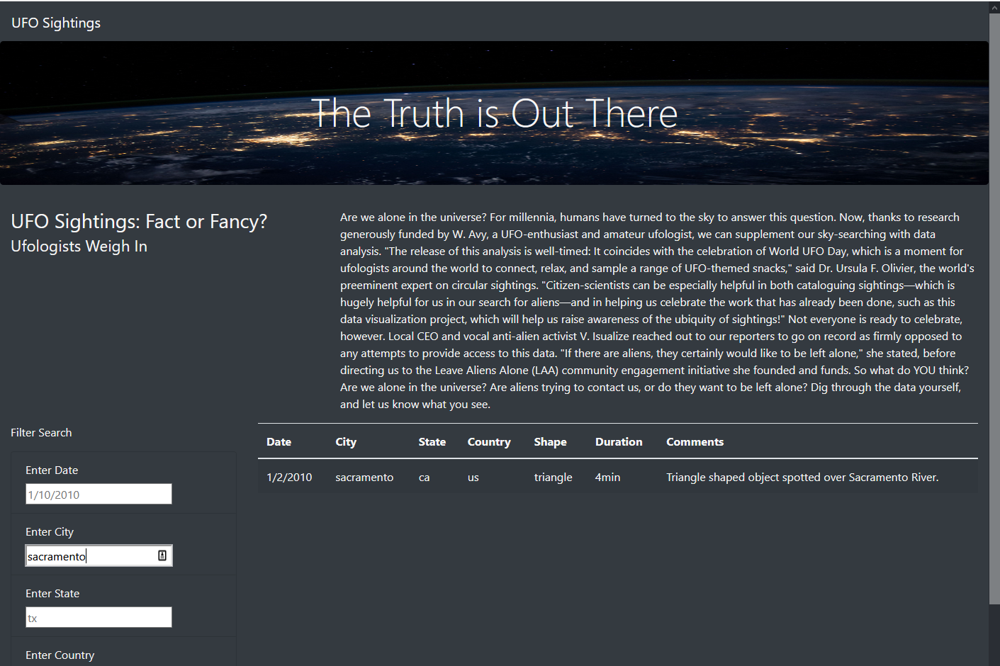
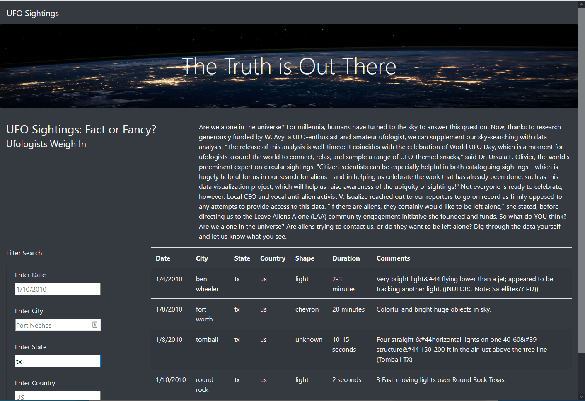
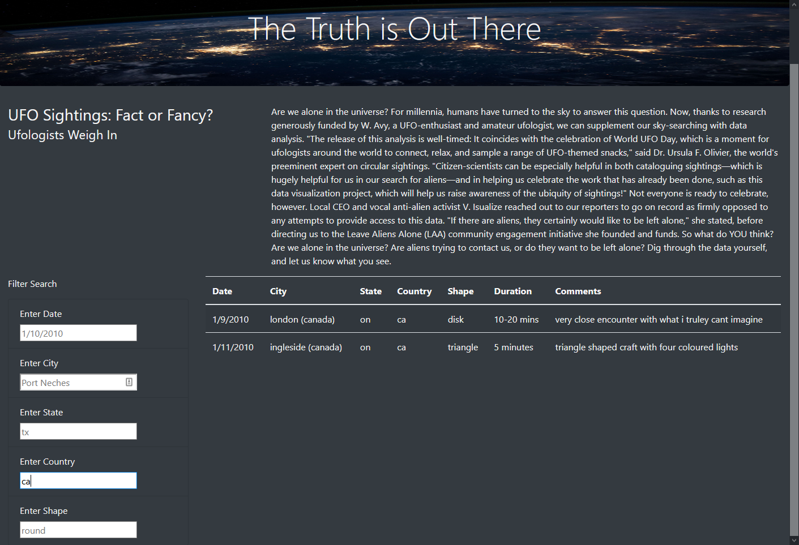
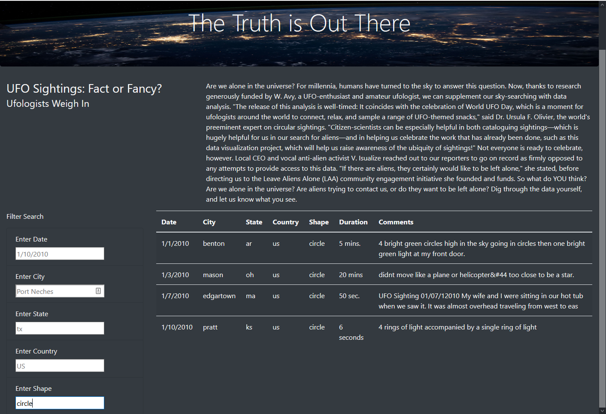
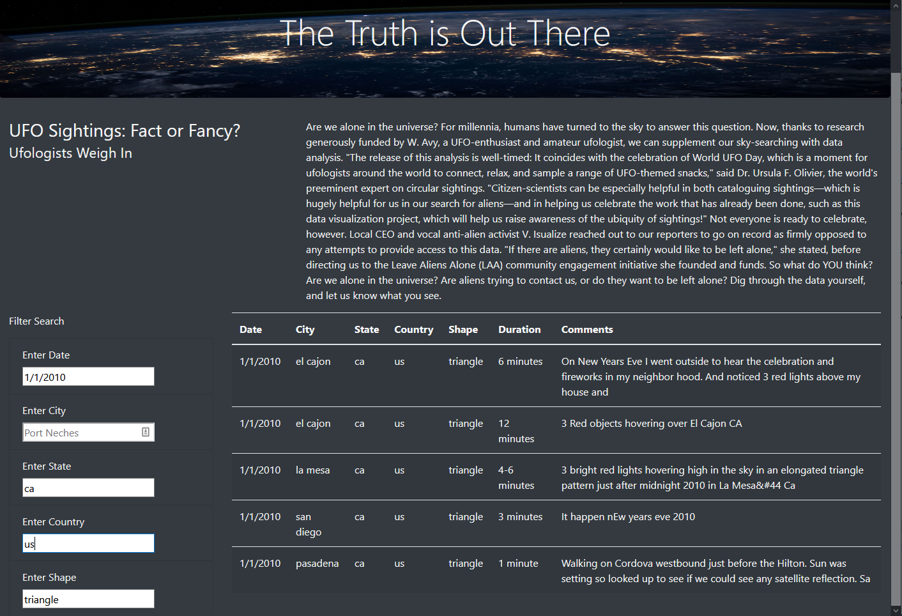

# UFOs

## Are you an aspiring UFOlogist? 
## Do you want to get involed with searching for UFO reported sightings?
Dana wants to know all the details about UFO sightings near and far and has created this
dynamic and interactive webpage using JavaScript, html, Bootstrap, and CSS. Dig into the data
by searching for a sighting with details such as date, city, state, country, and shape
of the unidentified flying object!

## How to query by date.
Type a date of your choosing between January 1, 2010 and January 13, 2010. Press Enter.

## How to query by city.
You can clear the previous date query to search a certain city's sightings or combine them to search for both. 

## How to query by state.
Type the lowercase two letter abbreviation for the state of your choosing. The above queries may be cleared
before hitting "Enter" on your keyboard or added for a narrowed search. 

## How to query by country.
Type the lowercase two letter abbreviation for the country of your choosing. 

## How to query by shape.
Type in a type of shape such as circle, light, triangle, fireball, disk, formation, sphere, other or unknown.

You may search for sightings by one of five of the criteria above. Input one, two or all of the query
fields to narrow down your search details. 

Thanks to Dana, this website has a great source of information on five categories describing UFO
sightings during several days in January of 2010. Additional information could be gleaned from this 
data set regarding the duration of the sighting or context clues from the commentary describing the 
event. Sightings are recorded from a couple of seconds or several minutes long. It could be very 
interesting to be able to search for types of UFO events that are over a minute long as an example. 

This list of information from data.js is not exhaustive by any means. If there would be an easy way to 
compile sighting data historically from egyptian times all the way up to sightings this year would be so informative. 
If Dana could link reported photos or videos from the sightings that also would be a great resouce
to link in this query. From gleaning this information can you decide if we are alone? Are we not alone in this universe?

